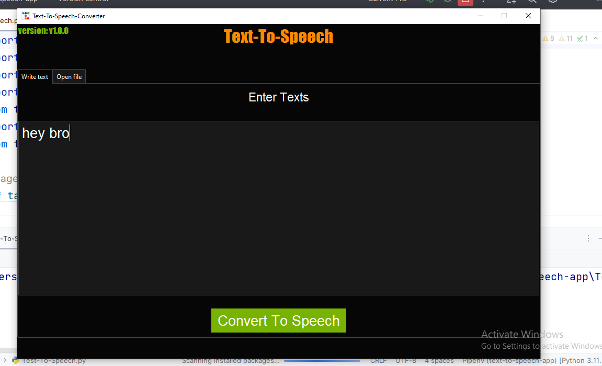
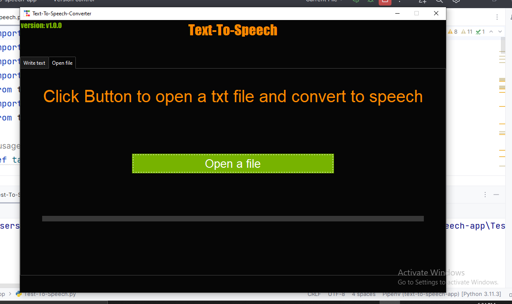

# text-to-speech
A text to speech desktop app written in python

## virtual env used:
1. pipenv

## packages i installed from pypi for the project:
1. pyttsx3 = "2.90"
2. ttkbootstrap = "1.10.1"

## in built libraries:
1. threading
2. tkinter

I installed pyinstaller globally

## version of python:
1. python version = "3.11.3"
2. pip = "23.2.1"

## pictures of the app

